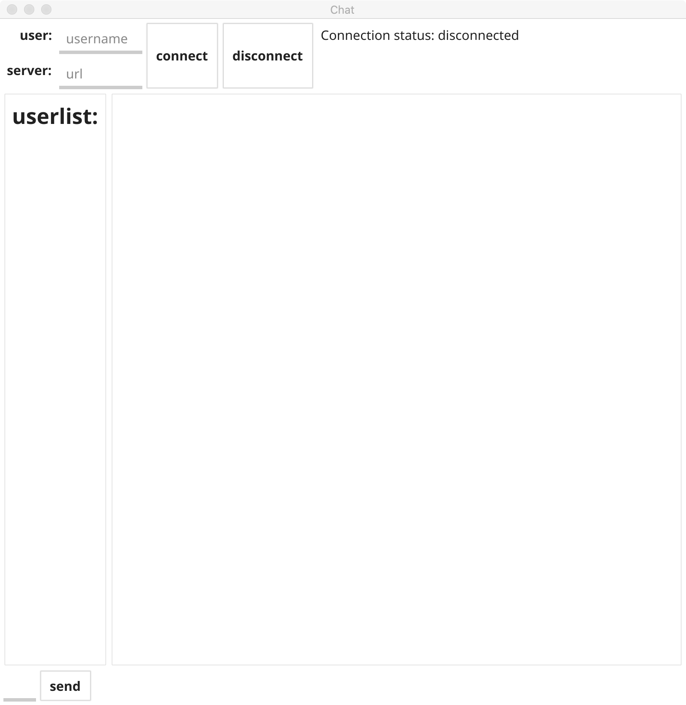
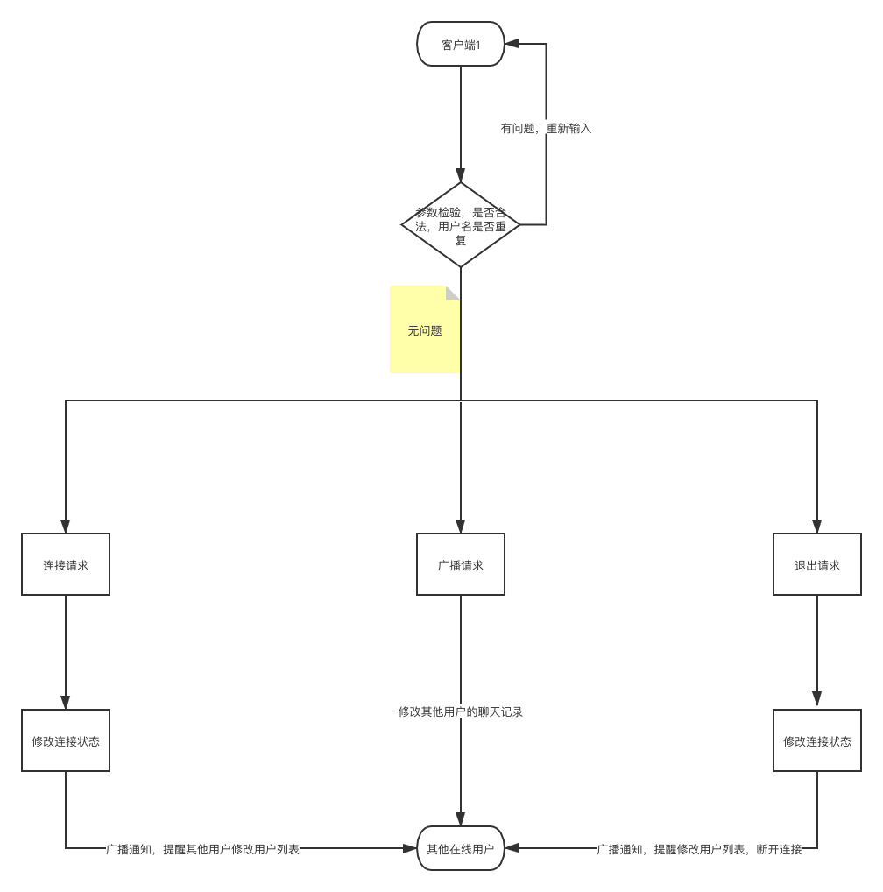

## 1.项目介绍

本项目主要设计了与第五题相连接的客户端界面，主要功能有用户登录，显示聊天信息，显示在线用户，发送信息等功能，通信协议使用的是第五题所用的websocket协议

## 2.代码逻辑分层

| 层      | 文件夹                             | 功能                           | 调用关系                |
| ------- | ---------------------------------- | ------------------------------ | ----------------------- |
| fyne    | fyne/app.go                        | 界面设计                       | 调用ctrl层              |
| ctrl    | Ctrl/ctrl.go                       | 负责点击事件处理               | 调用其他层              |
| model   | model/client.go.   model/pageFrame | 负责声明页面组件，以及信息交互 | 调用service             |
| message | message.pb.go message.proto        | proto文件                      | 被ctrl层和service层调用 |
| service | dealData                           | 常用的数据处理方法             | 被ctrl和model调用       |

## 3.通信数据处理

| 变量名   | 变量类型 | 说明     |
| -------- | -------- | -------- |
| UserName | string   | 用户名   |
| Msg      | string   | 发送数据 |
| MsgType  | string   | 消息类型 |
| List     | []*List  | 用户列表 |

## 4.界面设计



## 5.第三方库

```
fyne.io/fyne v1.4.3 // indirect
	github.com/golang/protobuf v1.5.2 // indirect
	github.com/gorilla/websocket v1.4.2 // indirect
	google.golang.org/protobuf v1.26.0 // indirect
```

## 6.编译运行

cd app

go build

./app

## 7.todo

代码进一步分层

## 流程图